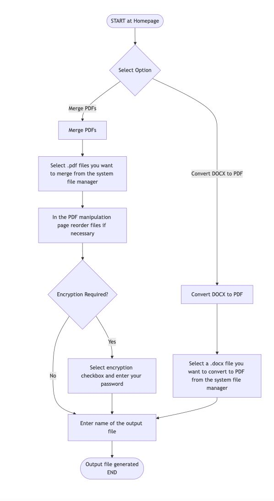

# Remix PDF Tool

Welcome to Remix, a simple and secure tool for working with PDFs. With Remix, you can merge PDF files, convert DOCX files to PDF, and encrypt your PDFs. All actions happen locally on your device so your files are never uploaded anywhere.

## Features

- Merge PDFs locally  
  Combine multiple PDF files on your computer. Your files stay private.

- Convert DOCX to PDF  
  Turn Word documents (.docx) into PDF format easily.

- Encrypt PDFs  
  Add password protection to your PDF files.

## How It Works

The tool is easy to use. Here's how the process works:

1. Start at the homepage and select an option.
2. If you choose Merge PDFs:
   - Pick the .pdf files from your computer.
   - You can reorder the files if you need to.
   - If you want encryption, check the box and type your password.
   - Enter the name for the final file.
   - The output file will be created.

3. If you choose Convert DOCX to PDF:
   - Select a .docx file from your computer.
   - If you want encryption, check the box and type your password.
   - Enter the name for the final file.
   - The output file will be created.

Here is the flowchart that shows the steps visually:

## Why Remix?

- All actions are done on your device. Files are not uploaded.
- The tool is simple and easy to understand.
- You can do everything (merge, convert, encrypt) in one place.

## Feedback and Contribution

This is the first version of Remix. We are testing and improving it.

If you have any ideas, find any bugs, or want to help us make Remix better, feel free to contact us or open an issue.

Thank you for using Remix. We really appreciate your support.
